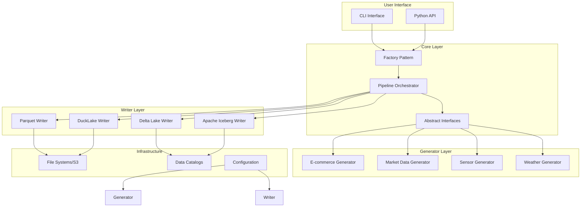
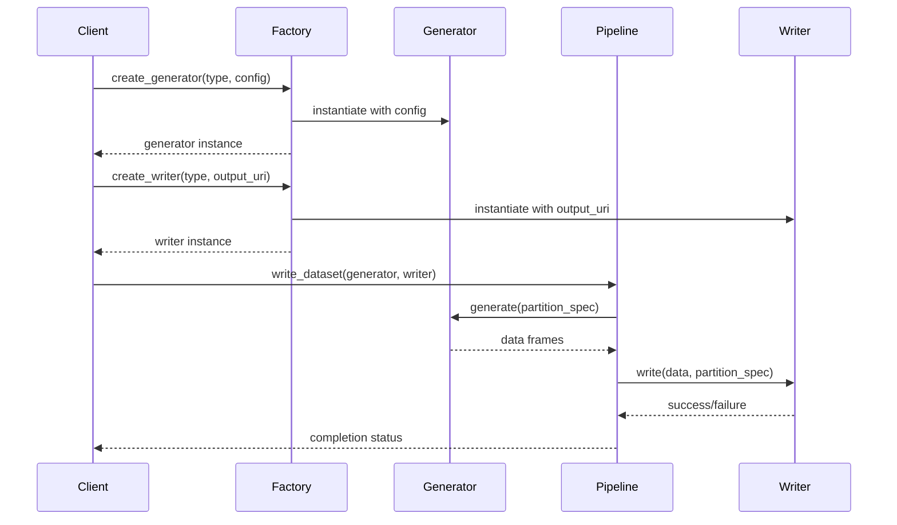
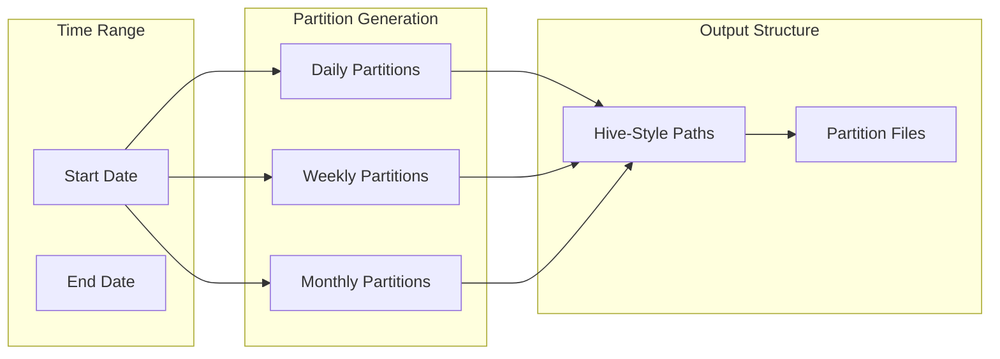

# Architecture

Overview of the Dataset Generator architecture and design patterns.

## High-Level Architecture



## Core Components

### 1. Factory Pattern

The factory pattern provides centralized creation of generators and writers:

```python
# src/dataset_generator/core/factory.py

def create_generator(generator_type: str, **kwargs) -> GeneratorBase:
    """Create a generator instance based on type"""
    generators = {
        "ecommerce": EcommerceGenerator,
        "market_ohlcv": MarketOHLCVGenerator,
        "market_quotes": MarketQuotesGenerator,
        "sensors": SensorGenerator,
        "weather": WeatherGenerator,
    }
    
    if generator_type not in generators:
        raise ValueError(f"Unknown generator type: {generator_type}")
    
    return generators[generator_type](**kwargs)

def create_writer(writer_type: str, output_uri: str, **kwargs) -> TableWriter:
    """Create a writer instance based on type"""
    writers = {
        "parquet": ParquetWriter,
        "delta": DeltaWriter,
        "iceberg": IcebergWriter,
        "ducklake": DuckLakeWriter,
    }
    
    if writer_type not in writers:
        raise ValueError(f"Unknown writer type: {writer_type}")
    
    return writers[writer_type](output_uri, **kwargs)
```

### 2. Pipeline Orchestrator

The pipeline orchestrates the generation and writing process:

```python
# src/dataset_generator/core/pipeline.py

def write_dataset(
    generator: GeneratorBase,
    writer: TableWriter,
    partition_spec: Optional[PartitionSpec] = None,
    progress_callback: Optional[Callable] = None
) -> None:
    """Generate data using generator and write using writer"""
    
    # Generate data
    if partition_spec is None:
        partition_spec = PartitionSpec.default()
    
    data = generator.generate(partition_spec)
    
    # Write data
    writer.write(data, partition_spec)
    
    if progress_callback:
        progress_callback("Generation completed")
```

### 3. Abstract Interfaces

Core interfaces define the contract for generators and writers:

```python
# src/dataset_generator/core/interfaces.py

@dataclass
class PartitionSpec:
    """Specification for data partitioning"""
    start_date: date
    end_date: date
    partition_by: List[str] = field(default_factory=lambda: ["year", "month", "day"])
    
    @classmethod
    def default(cls) -> PartitionSpec:
        """Create default partition specification"""
        today = date.today()
        return cls(
            start_date=today - timedelta(days=30),
            end_date=today
        )

class GeneratorBase(ABC):
    """Abstract base class for data generators"""
    
    @abstractmethod
    def generate(self, partition_spec: PartitionSpec) -> Dict[str, pl.DataFrame]:
        """Generate data for the given partition specification"""
        pass
    
    @abstractmethod
    def get_schema(self) -> Dict[str, pl.Schema]:
        """Return schema definitions for all generated tables"""
        pass

class TableWriter(ABC):
    """Abstract base class for table writers"""
    
    @abstractmethod
    def write(self, data: Dict[str, pl.DataFrame], partition_spec: PartitionSpec) -> None:
        """Write data according to partition specification"""
        pass
    
    @abstractmethod
    def get_output_uri(self) -> str:
        """Get the output URI for this writer"""
        pass
```

## Generator Architecture

### 1. Generator Inheritance Hierarchy

```python
GeneratorBase
├── EcommerceGenerator
├── MarketDataGenerator
│   ├── MarketOHLCVGenerator
│   └── MarketQuotesGenerator
├── SensorGenerator
└── WeatherGenerator
```

### 2. Generator Composition

Each generator is composed of several components:

```python
class EcommerceGenerator(GeneratorBase):
    def __init__(self, **config):
        self.config = EcommerceConfig(**config)
        self.customer_generator = CustomerGenerator(self.config)
        self.product_generator = ProductGenerator(self.config)
        self.order_generator = OrderGenerator(self.config)
        self.order_item_generator = OrderItemGenerator(self.config)
    
    def generate(self, partition_spec: PartitionSpec) -> Dict[str, pl.DataFrame]:
        # Generate master data
        customers = self.customer_generator.generate()
        products = self.product_generator.generate()
        
        # Generate transactional data by partition
        orders = []
        order_items = []
        
        for partition in self._create_partitions(partition_spec):
            partition_orders = self.order_generator.generate(partition, customers)
            partition_items = self.order_item_generator.generate(partition_orders, products)
            
            orders.append(partition_orders)
            order_items.append(partition_items)
        
        return {
            'customers': customers,
            'products': products,
            'orders': pl.concat(orders),
            'order_items': pl.concat(order_items)
        }
```

## Writer Architecture

### 1. Writer Inheritance Hierarchy

```python
TableWriter
├── FileSystemWriter
│   ├── ParquetWriter
│   └── DuckLakeWriter
└── CatalogBasedWriter
    ├── DeltaWriter
    └── IcebergWriter
```

### 2. Writer Patterns

#### FileSystem Writers

```python
class ParquetWriter(FileSystemWriter):
    """Writer for Parquet files with partitioning support"""
    
    def write(self, data: Dict[str, pl.DataFrame], partition_spec: PartitionSpec) -> None:
        for table_name, df in data.items():
            if table_name in ['customers', 'products']:
                # Master tables - no partitioning
                output_path = self.output_uri / f"{table_name}/{table_name}.parquet"
                df.write_parquet(output_path)
            else:
                # Transactional tables - time partitioning
                self._write_partitioned(df, table_name, partition_spec)
    
    def _write_partitioned(self, df: pl.DataFrame, table_name: str, 
                          partition_spec: PartitionSpec) -> None:
        """Write DataFrame with Hive-style partitioning"""
        for partition in self._create_partitions(df, partition_spec):
            partition_path = self._build_partition_path(table_name, partition)
            partition_path.mkdir(parents=True, exist_ok=True)
            
            output_file = partition_path / f"part-{uuid.uuid4()}.parquet"
            partition['data'].write_parquet(output_file)
```

#### Catalog-Based Writers

```python
class DeltaWriter(CatalogBasedWriter):
    """Writer for Delta Lake tables with catalog integration"""
    
    def write(self, data: Dict[str, pl.DataFrame], partition_spec: PartitionSpec) -> None:
        for table_name, df in data.items():
            # Create Delta table if it doesn't exist
            if not self.catalog.table_exists(table_name):
                self._create_delta_table(table_name, df)
            
            # Write data using Delta Lake
            delta_table = DeltaTable.forPath(self.catalog.get_table_path(table_name))
            delta_table.merge(
                source=df,
                predicate=f"target.{self._get_merge_key(table_name)} = source.{self._get_merge_key(table_name)}",
                source_alias="source",
                target_alias="target"
            ).when_not_matched_insert_all().execute()
```

## Configuration Architecture

### 1. Configuration Hierarchy

```python
@dataclass
class BaseConfig:
    """Base configuration class"""
    seed: Optional[int] = None
    file_rows_target: int = 250_000
    compression: str = "snappy"

@dataclass
class GeneratorConfig(BaseConfig):
    """Base configuration for generators"""
    start_date: date = field(default_factory=lambda: date.today() - timedelta(days=30))
    end_date: date = field(default_factory=lambda: date.today())

@dataclass
class EcommerceConfig(GeneratorConfig):
    """Configuration for e-commerce generator"""
    n_customers: int = 10000
    n_products: int = 5000
    orders_per_day: int = 100
    order_items_mean: float = 2.1
    order_items_std: float = 0.8
```

### 2. S3 Configuration

```python
@dataclass
class S3Config:
    """S3-compatible storage configuration"""
    uri: str
    endpoint_url: Optional[str] = None
    key: Optional[str] = None
    secret: Optional[str] = None
    region: str = "us-east-1"
    secure: bool = True
    anon: bool = False
    
    def to_fsspec_kwargs(self) -> Dict[str, Any]:
        """Convert to fsspec-compatible kwargs"""
        kwargs = {
            "anon": self.anon,
            "client_kwargs": {
                "region_name": self.region,
            }
        }
        
        if self.endpoint_url:
            kwargs["client_kwargs"]["endpoint_url"] = self.endpoint_url
        
        if self.key and self.secret:
            kwargs["key"] = self.key
            kwargs["secret"] = self.secret
        
        if not self.secure:
            kwargs["use_ssl"] = False
            kwargs["verify_ssl"] = False
        
        return kwargs
```

## Data Flow Architecture

### 1. Generation Pipeline



### 2. Partition Processing



## Plugin Architecture

### 1. Generator Registration

```python
# Plugin system for custom generators
GENERATOR_REGISTRY: Dict[str, Type[GeneratorBase]] = {}

def register_generator(name: str):
    """Decorator to register a generator"""
    def decorator(cls: Type[GeneratorBase]):
        GENERATOR_REGISTRY[name] = cls
        return cls
    return decorator

# Usage
@register_generator("custom_domain")
class CustomGenerator(GeneratorBase):
    pass
```

### 2. Writer Registration

```python
# Similar registration for writers
WRITER_REGISTRY: Dict[str, Type[TableWriter]] = {}

def register_writer(name: str):
    """Decorator to register a writer"""
    def decorator(cls: Type[TableWriter]):
        WRITER_REGISTRY[name] = cls
        return cls
    return decorator
```

## Performance Architecture

### 1. Memory Management

```python
class StreamingGenerator(GeneratorBase):
    """Generator that processes data in chunks to manage memory"""
    
    def __init__(self, chunk_size: int = 100_000):
        self.chunk_size = chunk_size
    
    def generate_streaming(self, partition_spec: PartitionSpec):
        """Generate data in chunks"""
        for chunk in self._create_chunks(partition_spec):
            yield self._process_chunk(chunk)
    
    def _create_chunks(self, partition_spec: PartitionSpec):
        """Create data chunks based on configuration"""
        # Implementation depends on specific generator
        pass
```

### 2. Parallel Processing

```python
import multiprocessing as mp
from concurrent.futures import ProcessPoolExecutor

class ParallelPipeline:
    """Pipeline that supports parallel processing"""
    
    def __init__(self, max_workers: Optional[int] = None):
        self.max_workers = max_workers or mp.cpu_count()
    
    def process_partitions_parallel(self, partitions: List[PartitionSpec]) -> None:
        """Process multiple partitions in parallel"""
        with ProcessPoolExecutor(max_workers=self.max_workers) as executor:
            futures = [
                executor.submit(self._process_partition, partition)
                for partition in partitions
            ]
            
            for future in concurrent.futures.as_completed(futures):
                result = future.result()
                self._handle_result(result)
```

## Testing Architecture

### 1. Test Structure

```
tests/
├── unit/
│   ├── test_generators/
│   │   ├── test_ecommerce.py
│   │   ├── test_market_data.py
│   │   └── test_sensors.py
│   ├── test_writers/
│   │   ├── test_parquet.py
│   │   ├── test_delta.py
│   │   └── test_iceberg.py
│   └── test_core/
│       ├── test_factory.py
│       ├── test_pipeline.py
│       └── test_interfaces.py
├── integration/
│   ├── test_end_to_end.py
│   ├── test_s3_integration.py
│   └── test_catalog_integration.py
└── fixtures/
    ├── sample_data/
    └── configs/
```

### 2. Test Utilities

```python
# tests/conftest.py
import pytest
from unittest.mock import Mock
from dataset_generator import create_generator, create_writer

@pytest.fixture
def temp_output_dir(tmp_path):
    """Temporary directory for output files"""
    return tmp_path / "output"

@pytest.fixture
def sample_generator():
    """Sample generator for testing"""
    return create_generator(
        "ecommerce",
        seed=42,
        n_customers=100,
        orders_per_day=10
    )

@pytest.fixture
def sample_writer(temp_output_dir):
    """Sample writer for testing"""
    return create_writer("parquet", str(temp_output_dir))
```

## Deployment Architecture

### 1. Package Structure

```
dataset_generator/
├── __init__.py
├── cli/
│   ├── __init__.py
│   └── main.py
├── core/
│   ├── __init__.py
│   ├── factory.py
│   ├── pipeline.py
│   └── interfaces.py
├── generators/
│   ├── __init__.py
│   ├── ecommerce.py
│   ├── market_data.py
│   ├── sensors.py
│   └── weather.py
├── writers/
│   ├── __init__.py
│   ├── parquet.py
│   ├── delta.py
│   ├── iceberg.py
│   └── ducklake.py
└── config/
    ├── __init__.py
    ├── base.py
    └── s3.py
```

### 2. CLI Architecture

```python
# src/dataset_generator/cli/main.py
import typer
from typing import Optional

app = typer.Typer(help="Dataset Generator CLI")

@app.command()
def generate(
    generator_type: str = typer.Argument(..., help="Type of generator to use"),
    output_uri: str = typer.Argument(..., help="Output URI for generated data"),
    writer_type: str = typer.Option("parquet", help="Writer type"),
    seed: Optional[int] = typer.Option(None, help="Random seed"),
    **kwargs
):
    """Generate synthetic data"""
    
    generator = create_generator(generator_type, seed=seed, **kwargs)
    writer = create_writer(writer_type, output_uri)
    
    write_dataset(generator, writer)
    
    typer.echo(f"Data generated successfully to {output_uri}")
```

## Future Architecture Considerations

### 1. Microservices

- Separate generator services for different domains
- Shared writer service
- API gateway for coordination
- Message queues for asynchronous processing

### 2. Cloud-Native

- Kubernetes deployment
- Scalable processing with auto-scaling
- Distributed storage integration
- Observability and monitoring

### 3. Data Governance

- Data quality metrics
- Lineage tracking
- Compliance and privacy controls
- Auditing capabilities

## Related Documentation

- **[Testing Guide](testing.md)** - Testing strategies and practices
- **[Contributing Guide](contributing.md)** - Development guidelines
- **[API Reference](../api/core.md)** - Detailed API documentation
