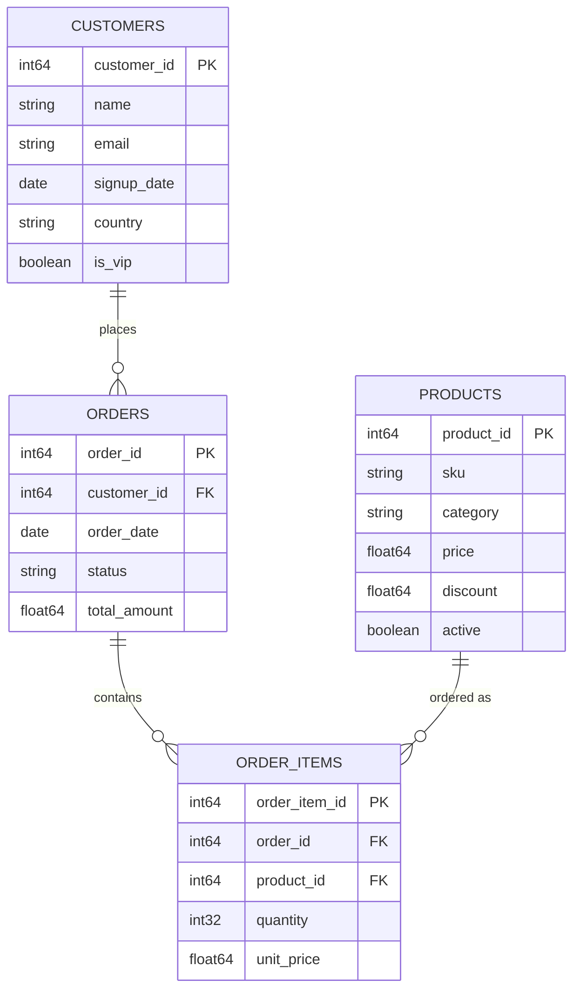

# E-commerce Generator

The e-commerce generator creates realistic online retail data including customers, products, orders, and order items. It's perfect for testing e-commerce platforms, analytics systems, and data pipelines.

## Overview

The e-commerce generator simulates a complete online retail ecosystem with:

- **Customers** with realistic demographics and behavior patterns
- **Products** across different categories with pricing and inventory
- **Orders** with proper status flows and timing
- **Order Items** linking products to orders with quantities and pricing

## Data Model



## Configuration

### Basic Parameters

```python
generator = create_generator(
    "ecommerce",
    seed=42,                    # Reproducibility
    n_customers=10_000,         # Number of unique customers
    n_products=1_000,           # Number of unique products  
    orders_per_day=5_000,       # Average orders per day
    start_date=date(2024, 1, 1), # Start date for orders
    end_date=date(2024, 1, 31), # End date for orders
    file_rows_target=250_000,   # Target rows per output file
)
```

### Advanced Parameters

```python
generator = create_generator(
    "ecommerce",
    # Basic params
    seed=42,
    n_customers=10_000,
    n_products=1_000,
    orders_per_day=5_000,
    start_date=date(2024, 1, 1),
    end_date=date(2024, 1, 31),
    
    # Advanced options
    vip_customer_ratio=0.1,     # 10% of customers are VIP
    product_categories=[
        "Electronics", "Clothing", "Books", 
        "Home", "Sports", "Toys"
    ],
    order_status_distribution={
        "pending": 0.1,
        "processing": 0.2, 
        "shipped": 0.4,
        "delivered": 0.25,
        "cancelled": 0.05
    },
    avg_items_per_order=3.5,    # Average items in each order
)
```

## Data Characteristics

### Customers

- **Customer IDs**: Sequential integers starting from 1
- **Names**: Realistic generated names
- **Email**: Format: `firstname.lastname@email.com`
- **Signup Dates**: Distributed between start_date - 365 days and start_date
- **Countries**: Weighted distribution of major countries
- **VIP Status**: Based on configurable ratio

### Products

- **Product IDs**: Sequential integers starting from 1
- **SKUs**: Format: `CAT-XXXXX` (category + random number)
- **Categories**: Configurable list of product categories
- **Prices**: Log-normal distribution within category ranges
- **Discounts**: Percentage discounts (0-50%)
- **Active Status**: 95% of products are active

### Orders

- **Order IDs**: Sequential integers starting from 1
- **Order Dates**: Distributed across the date range
- **Status**: Based on configurable distribution
- **Total Amount**: Sum of order item quantities × prices

### Order Items

- **Quantities**: Poisson distribution (mean=2, max=10)
- **Unit Prices**: Product price at time of order
- **Product Selection**: Weighted by category popularity

## Usage Examples

### CLI Usage

```bash
# Basic e-commerce dataset
dataset-generator generate ecommerce \
  --format parquet \
  --output ./ecommerce-data \
  --start 2024-01-01 \
  --end 2024-01-31 \
  --n-customers 10000 \
  --orders-per-day 5000

# Large dataset for performance testing
dataset-generator generate ecommerce \
  --format delta \
  --output ./large-ecommerce \
  --start 2023-01-01 \
  --end 2023-12-31 \
  --n-customers 1000000 \
  --orders-per-day 50000 \
  --file-rows-target 1000000
```

### Python API

```python
from datetime import date
from dataset_generator import create_generator, create_writer, write_dataset

# Create generator
generator = create_generator(
    "ecommerce",
    seed=42,
    n_customers=50_000,
    n_products=5_000,
    orders_per_day=10_000,
    start_date=date(2024, 1, 1),
    end_date=date(2024, 3, 31),
)

# Create writer
writer = create_writer(
    "parquet",
    output_uri="./ecommerce-data",
)

# Generate data
write_dataset(generator, writer)
```

## Output Structure

The generator creates four main tables:

```
ecommerce-data/
├── customers/
│   └── customers.parquet              # All customer data
├── products/
│   └── products.parquet               # All product data
├── orders/
│   ├── year=2024/month=01/day=01/
│   │   └── part-00000.parquet        # Orders by date
│   └── ...
└── order_items/
    ├── year=2024/month=01/day=01/
    │   └── part-00000.parquet        # Order items by date
    └── ...
```

## Performance Considerations

### Memory Usage

- **Customers and Products**: Loaded entirely into memory
- **Orders and Order Items**: Streamed in batches
- **Typical Memory**: ~100MB for 100K customers + 10K products

### Generation Speed

- **Small datasets** (<1M orders): ~10K orders/second
- **Large datasets** (>10M orders): ~50K orders/second
- **Bottleneck**: Usually I/O, not CPU

### Optimization Tips

```python
# For very large datasets
generator = create_generator(
    "ecommerce",
    file_rows_target=1_000_000,  # Larger files = less overhead
    # ... other params
)

# For memory-constrained environments
generator = create_generator(
    "ecommerce",
    n_customers=10_000,           # Fewer customers = less memory
    # ... other params
)
```

## Realistic Features

### Temporal Patterns

- **Seasonal trends**: Order volume varies by date
- **Customer lifecycle**: New customers sign up over time
- **Product lifecycle**: Products have introduction dates

### Business Logic

- **VIP customers**: Higher order frequency and values
- **Product popularity**: Some products are ordered more frequently
- **Order fulfillment**: Realistic status progression

### Data Quality

- **Referential integrity**: All foreign keys are valid
- **Consistent timestamps**: Order dates are within specified range
- **Realistic values**: Prices, quantities, and amounts make sense

## Next Steps

- **[Other Generators](market.md)** - Explore market data, sensors, and weather
- **[Writer Configuration](../writers/parquet.md)** - Choose output format
- **[S3 Integration](../s3.md)** - Store data in the cloud
- **[Examples](../../examples/jupyter.md)** - Complete working examples